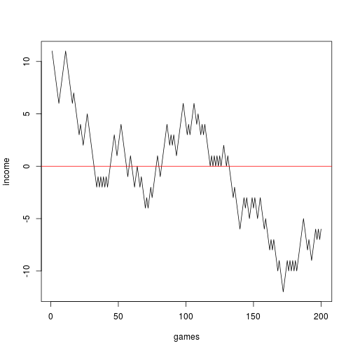

1 Introduction: Monte Carlo Methods
========================================================
author: Jonathan Navarrete
date: 
autosize: true

Introduction to Monte Carlo
========================================================

Monte Carlo methods are methods for generating random variables directly 
or indirectly from target distributions. We generate random variables to 
estimate p-values or parameters.

Applications of monte carlo methods are in hypothesis testing and 
Bayesian computation.


Gambler's ruin
========================================================

Consider two gamblers, persons A and B, who start to gamble in a zero-sum game with stakes \$x and \$b-x, respectively.
At each round, each gambler puts up a stake of \$h. The probability that A wins a round is *p*, while the probability that B wins a round is *q = 1 - p*. We wish to compute the probability that A ultimately wins the game. Let us define $v(x,t)$ to the probability that A ultimately wins the game starting with capital \$x on or before the *t*th round. Similarly, $u(x,t)$ is the probability that B wins the game with their stake of $b-x$ on or before the *t*th round. 

Each of three variables v,u, and w is bounded below by zero and above by 1. Moreover, u and v are nondecreasing in t. w is nonincreasing in t. Thus we can take limits of each of these as t goes to infinity. We shall call these limits v(x), u(x), and w(x), respectively.


Gambler's ruin, pt.2
========================================================


Gambler's ruin (fallacy) is the belief that a certain event is $more$ likely to occur given the past history. In an experiment where there is a coin toss with probability of seeing heads as 0.5. Each flip of a coin has the same probability of landing on heads regardless of what the previous lands were. 

Imagine a gambler on a roulete table. Say the gambler starts with \$10. In this game, the gambler "wins" when they earn a total of \$20 (that is they must play the game until they've earned $10 on top of their starting \$10). For each game, there is a probability of winning, p = 0.473. Then, can we  see how many turns until he/she wins (or loses)?


Slide With Code
========================================================


```r
set.seed(678)
N = 200
income = 10
games = 2*(runif(N)<0.473) - 1 ## generate 1s and -1s
out = cumsum(games) + income

plot(1:N, out, type = "l", xlab = "games", ylab = "income")
abline(h = 0, col = "red")
```



```r
GamblersRuin = function(i){
  income = 10
  n = 0
  while(!(income %in% c(0,20))){
    n = n + 1 ## number of runs till ruin or success
    x = runif(1)
    if(x <= 0.473){
      income = income + 1
    } else{
      income = income - 1
    }
  }
  return(c(n,income))
}

GamblersRuin()
```

```
[1] 154   0
```

```r
out = lapply(X = 1:100, FUN = GamblersRuin)
out = do.call(rbind, out)

## percentage of success
sum(out[,2] == 20 )
```

```
[1] 27
```


Hypothesis Testing
========================================================

There are two ways that the Chi-squared test is used:

1. comparing the observed distribution to some theoretical distribution pre-specified ahead of time: to test the *Goodness of fit* of the theoretical distribution to the observations;

2. testing for *independence* between different factors (which, technically, is just a specific theoretical distribution, with some extra parameters that must be estimated from the data).

To review the Chi-squared test, follow the [*link*](https://en.wikipedia.org/wiki/Pearson%27s_chi-squared_test#Assumptions)

$$
\begin{center}
\begin{tabular}{l*{6}{c} r}
\hline
Data        & Cancer Controlled   & Cancer not Controlled   & Total \\
\hline
Surgery     & 21                  & 2                       & 23 \\
Radiation   & 15                  & 3                       & 18 \\
\hline
\hline
Total       & 36                  & 5                       & 41 \\
\end{tabular}
\end{center}
$$


However, a disadvantage of the chi-square test is that it requires a sufficient sample size in order for the chi-square approximation to be valid. When cell counts are low, say, below 5 asymptotic properties do not hold well. Therefore, a simple chi-squred test may report an invalid p-value which would increase a **Type I error** rate. A solution is to use Monte Carlo simulation to generate samples from the null distribution in order to estimate a more accurate p-value to our hypothesis. 


```r
study = matrix(data = c(21, 2,
                        15, 3), nrow = 2, ncol = 2, byrow = TRUE,
               dimnames = list(c("surgery", "radiation"), 
                               c("controlled", "not controlled")))

print(study)
```

```
          controlled not controlled
surgery           21              2
radiation         15              3
```


Hypothesis Testing, pt. 2
========================================================

Set up some functions in order to generate our Chi-squared statistic and Monte Carlo p-value.


```r
## set up

## function will generate chi-squared statistics 
## using the expected distribution of the data
simulateChisq <- function(B, E, sr, sc){
    results = numeric(B)
    for(i in 1:B){
        dat = unlist(r2dtable(1, sr, sc))
        M = matrix(dat, ncol = length(sc), nrow = length(sr))
        val = sum( sort( (M - E)^2 / E, decreasing = TRUE))
        results[i] = val
    }
    return(results)
}

## this will produce chi-squared test
ChisqTest <- function(data, Simulations){
    ## data should be a 2X2 matrix
    x = data
    B = Simulations
    n <- sum(x)
    sr <- rowSums(x)
    sc <- colSums(x)
    E <- outer(sr, sc, "*")/n ## ORDER MATTERS
    dimnames(E) <- dimnames(study)
    tmp <- simulateChisq(B, E, sr, sc)
    Stat <- sum(sort((x - E)^2/E, decreasing = TRUE))
    pval <- (1 + sum(tmp >=  Stat))/(B + 1)
    df = 2 ## only option for this example
    rawPVal = pchisq(q = Stat, df = df, lower.tail = FALSE)
    out = list(PearsonStat = Stat, MonteCarloPVal = pval, rawPVal = rawPVal)
    return(out)
}
```


Hypothesis Testing, pt. 3
========================================================

We then generate our test statistics.


```r
set.seed(123)

results <- ChisqTest(study, 10000)

print(results)
```

```
$PearsonStat
[1] 0.5991546

$MonteCarloPVal
[1] 0.6417358

$rawPVal
[1] 0.7411314
```

```r
## compare against chisq.test()
```

Though our ultimate decision to support the null hypothesis of dependence is not a surprise, our results show that the Monte Carlo p-value is greater than the raw p-value obtained from the calculated $\chi^2$ statistic indicating more support for the null hypothesis. Readers should compare these results against R's `chisq.test` function.


Bayesian Example
========================================================
Here is an example taken from $Bayesian\ Ideas\ and\ Data\ Analysis$ by Christensen et al.

$$
y | \theta \sim Bin(2430, \theta)
\
and 
\
\theta \sim Beta(12.05, 116.06)
\
$$
This is a beta-binomial problem. There is a beta prior distribution on $\theta$. Beta is conjugate to the binomial distribution (see: <https://en.wikipedia.org/wiki/Conjugate_prior#Discrete_distributions>). Bayesian anaysis uses prior information combined with observed data to update a probability distribution, posterior distribution, from which we can obtain a probability value. The new probability distribution, posterior, describes knowledge about the unkown parameter $\theta$ from historical beliefs (e.g. previous experiments, reports, etc.) and current observed data.

$$
y | \theta \sim Bin(n, \theta)
\
and
\
\theta \sim Beta(a, b)
$$ 

The resulting posterior distribution is then
$$
\theta | y \sim Beta(y + a, n -y + b)
$$


Bayesian Example, pt. 2
========================================================
We can now simulate the posterior distribution


```r
N = 10^4
set.seed(123)
x = rbeta(n = N, shape1 = 219 + 12.05, shape2 = 2430 - 219 + 116.06)
d = density(x)
hist(x = x, probability = TRUE, 
      main = "Beta Posterior Distribution",
     xlab = "x (posterior values)", ylab = "Density",
     ylim = c(0,80))
lines(x = d$x , y = d$y, type = "l", col = 2)
```


```r
print("Median: ")
```

```
[1] "Median: "
```

```r
print(quantile(x = x, probs = c(0.025, 0.5, 0.975)))
```

```
      2.5%        50%      97.5% 
0.07942339 0.09018049 0.10164574 
```


Bayesian Example, pt. 3
========================================================

We can tell the VP that the true probability lies between 7.9% and 10.2%, with median probability of 9%.


